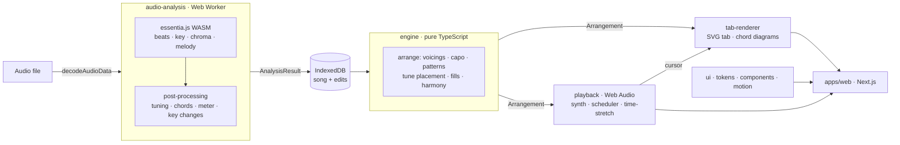

# Thumbline

**Turn a song into a right-hand guitar part you can play along with, in the browser, with nothing uploaded.**

Drop in an audio clip. Thumbline hears the beat, key, chords and tune, then writes an arrangement for the picking hand (Arpeggio, Fingerstyle or Flamenco, at Basic, Moderate or Advanced) and plays it in sync with the original recording. It writes an arrangement, not a transcription: the goal is a part a real hand can play that still sounds like the song.

Live: [thumbline.app](https://thumbline.app)

---

## The problem, in engineering terms

Three hard problems have to work together on one page, in real time, on the user's own device:

1. **Hearing the song.** Beat, meter, key, chords and melody from a mixed recording, using a C++ signal-processing library compiled to WebAssembly, run in a Web Worker so the page stays responsive.
2. **Writing a playable part.** Turning noisy, uncertain analysis into notes a human hand can play: fret reach, finger count, capo position, a melody that fits the top strings, and fills, harmony and variation that suit the song's mood.
3. **Playing it in sync.** A synthesised guitar and the original recording on one audio clock, so they stay together at 50–100% speed (pitch preserved), across loops and seeks, with a playhead drawn from the sound the listener actually hears.

No backend. No audio leaves the device.

## Architecture



| Package | Responsibility | Depends on |
|---|---|---|
| `packages/audio-analysis` | Audio → `AnalysisResult`, in a Web Worker | nothing in the repo |
| `packages/engine` | `AnalysisResult` + style + level → `Arrangement`. Pure: no DOM, no audio, no React | nothing in the repo |
| `packages/tab-renderer` | React SVG tab, chord diagrams, playhead | engine types, ui |
| `packages/playback` | Karplus–Strong guitar synth, lookahead scheduler, WSOLA time-stretch | engine types |
| `packages/ui` | Design tokens, 21 components, motion primitives, Lottie moments | nothing in the repo |
| `apps/web` | Next.js App Router: Upload → Listen → Sheet | everything |

The boundaries are enforced by lint (`@nx/enforce-module-boundaries`), and the two data contracts between stages, `AnalysisResult` and `Arrangement`, are specified in [docs/engine-spec.md](docs/engine-spec.md). Any change to them updates the spec in the same commit.

## Design decisions

**1. A pure engine between analysis and playback.**
Analysis is probabilistic and playback is timing-critical; the engine sits between them as a pure function with written contracts. That makes the musically hard part (33 patterns as data, voicings, capo choice, a playability checker for reach and fingers) testable without audio or a browser: the engine alone has 783 unit tests, including snapshot tests of whole arrangements.

**2. One audio clock for the synth and the recording.**
The synth and the original recording are scheduled on the same `AudioContext` clock with a 150 ms lookahead, rather than `setTimeout` timing. Every loop pass or speed change is a new "pass" that maps song time to audio time, so they cannot drift. Slower speeds play a WSOLA time-stretched copy of the original, prepared in the background and cached per ratio. The playhead is driven by `getOutputTimestamp()`, so it follows what is heard, not what was scheduled.

**3. Analysis changes are measured against ground truth.**
`pnpm nx run audio-analysis:eval` scores tempo, meter and chords against ground truth (20 synthetic songs plus licensed local references). A change ships when the numbers support it. Two examples from [PLAN.md](PLAN.md):
- *Off-pitch records.* Two 1960s–70s film songs sat a third of a semitone flat, so every note fell between chroma bins. Measuring each recording's tuning and reading against it cut spurious maj7 chords from 29 to 9 and out-of-key melody notes from 26% to 11%, with the eval unchanged.
- *A rejected fix.* A ballad was read at double tempo. Halving when chords looked "too long" failed on the data (median chord length matched a real 150 bpm song), so it shipped as a user-facing Half / Double tempo control instead of a heuristic that would misfire.

**4. No audio leaves the device.**
Worker plus WebAssembly for analysis, IndexedDB for the song and the user's edits, no upload endpoint. The cost is analysis time (about 15 s for a 3-minute song on a laptop) and a large WebAssembly payload, mitigated by loading the worker and its WebAssembly only when analysis starts, and the animation player only on first interaction.

**5. Chords are corrected on the sheet.**
Chords are corrected on the sheet itself: tap a chord, hear that bar of the original, choose from ranked guesses or any root and type. Uncertain chords are flagged by rank (the least sure ~12%), not by a fixed threshold, because confidence runs low across whole genres. Each flag carries a mark and spoken text, never colour alone. Per-section settings (pattern and "fullness") feed back into the engine bar by bar.

## Quality

| | |
|---|---|
| Unit tests | 1,398 (engine 783, ui 227, web 113, audio-analysis 98, playback 97, tab-renderer 80), Vitest |
| End-to-end | Playwright: upload → listen → sheet → edit a chord → play, with axe-core checks on the upload and sheet screens |
| Components | Storybook stories for each component's states (default, hover, focus, disabled where it applies, reduced motion) |
| Accessibility | Real buttons and focus rings, 44 px targets, every animation respects `prefers-reduced-motion` |
| Lighthouse | SEO, accessibility and best practices 100 (local production build, 2026-10-06) |
| Analysis eval | Tempo within ±3 bpm on 95% of the synthetic set; chord root 88%, major/minor 81% |

## Known limitations and roadmap

- **Performance budget:** first-load JavaScript (target under 200 KB gzipped) and LCP (target under 2 s) are not yet enforced in CI.
- **Speed changes:** time-stretching a 3-minute clip runs on the main thread and blocks it for about 80 ms; it should move to a worker.
- **Sound:** the synth puts 10–12% of its energy in 80–250 Hz, against 21–41% in real recordings, so it sounds thinner. Options are a body model or licensed samples.
- **Tempo:** a slow song with a bass on every beat can be read at double tempo. Customize has a Half / Double control; detecting it automatically needs a better cue than bass alternation.

Milestones, with the reasoning and measurements behind each change, are in [PLAN.md](PLAN.md).

---

## Getting started

Requires Node 24+ and pnpm (version pinned in `package.json` → `packageManager`; `corepack enable` picks it up).

```bash
pnpm install
pnpm nx dev web            # app at http://localhost:3000
```

```bash
pnpm nx test <project>                  # unit tests (Vitest)
pnpm nx lint <project>
pnpm nx run-many -t lint test build     # everything
pnpm nx affected -t lint test build     # what CI runs
pnpm nx run audio-analysis:eval         # analysis accuracy against ground truth
pnpm nx storybook ui                    # UI kit
pnpm nx e2e web-e2e                     # Playwright
pnpm nx graph                           # dependency graph
```

## Docs

- [PLAN.md](PLAN.md): scope, architecture, milestones and the decision log
- [docs/engine-spec.md](docs/engine-spec.md): data contracts and algorithms
- [docs/design/](docs/design/): design system, motion, screens
- [AGENTS.md](AGENTS.md): rules for contributors and coding agents

## Licence

AGPL-3.0-or-later (required by essentia.js). Test audio is not committed; see `fixtures/audio/LICENSES.md`.
